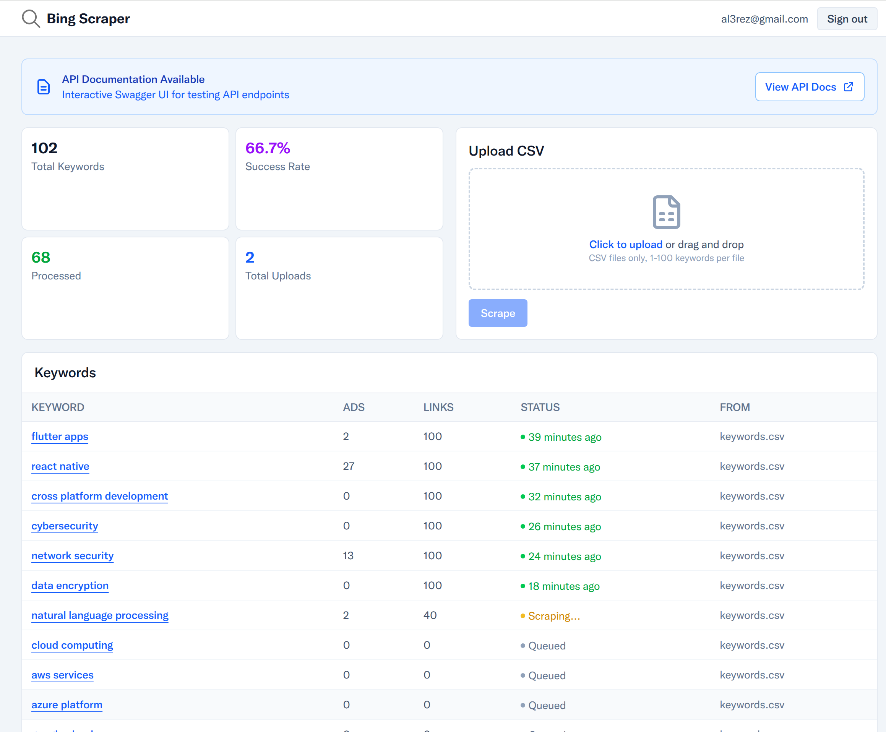
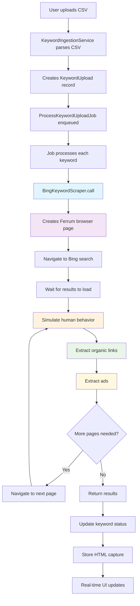

# Bing Scraper

Rails app that scrapes Bing search results at scale. Upload CSV of keywords, get search data back.



## Features

- CSV upload with 1-100 keywords
- Scrapes Bing for each keyword (ads count, links, full HTML)
- Real-time processing updates
- PostgreSQL storage for analysis

## Tech Stack

**Rails 8** with Devise authentication, Sidekiq + Redis for background jobs, TailwindCSS for styling, PostgreSQL database, and Selenium + Chrome for scraping.

## How it Works



## Running it locally

```bash
git clone [repo]
cd bing-scraper
bundle install
# this will setup postgresql and redis, if you have them on your local machine no need for this
docker compose up -d
rails db:create db:migrate
./bin/dev
```

Go to `http://localhost:3000`

## Deploying to Heroku

This is running on Heroku with:
- 2 dynos (web + worker)
- Heroku Postgres
- Heroku Redis (they call it Key-Value Store now)
- Chrome buildpack for headless scraping

### Quick deploy

```bash
heroku create your-app
heroku buildpacks:add heroku/ruby
heroku buildpacks:add heroku-community/chrome-for-testing
heroku addons:create heroku-postgresql:essential-0
heroku addons:create heroku-redis:mini
git push heroku main
heroku run rails db:migrate
heroku ps:scale worker=1
```

Don't forget to set your master key:
```bash
heroku config:set RAILS_MASTER_KEY=$(cat config/master.key)
heroku config:set BROWSER_PATH=$(which chrome)
```

## Usage

1. Sign up / sign in
2. Upload CSV (one keyword per line, optional "keyword" header)
3. Watch keywords process in real-time
4. Click keywords to see full results
5. Download HTML captures if needed

## Testing

```bash
bundle exec rspec
```
